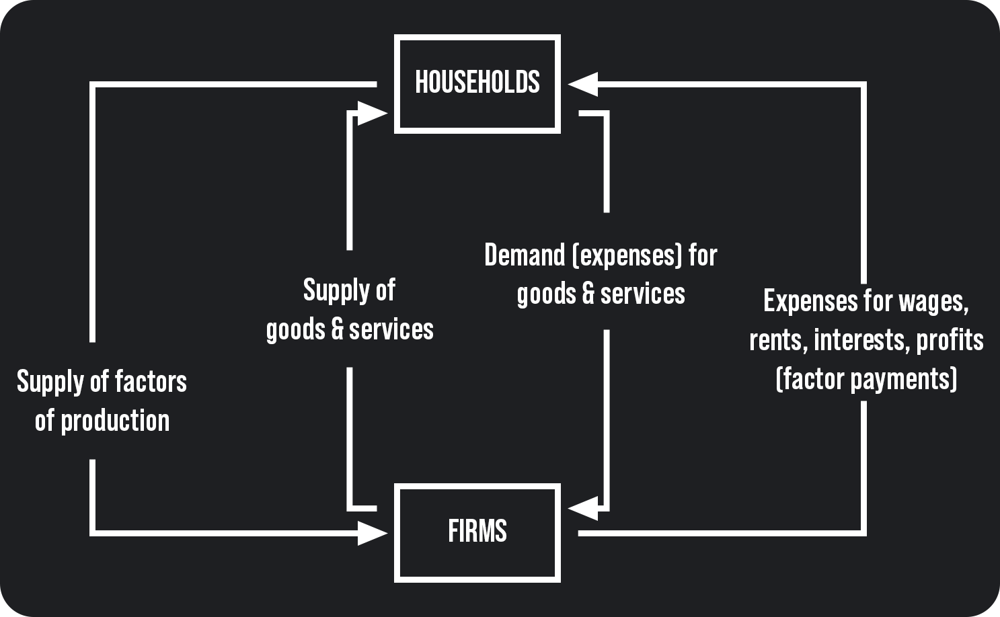

# Seminar 2: Macroeconomic analysis

### <ins>Types of economic sectors:
1. households 🏠
2. firms 🏢
3. government 🏛️
4. foreign sector

### <ins>Types of markets:
1. Goods & Services market 💹
2. factors markets (labour, land, capital), **but not for entrepreneurship** 💸
3. monetary market 💵

### <ins>Types of factors of production:
1. labour $\Rightarrow$ **reward: wage** $\Rightarrow$ full-time, part-time, temporary workers 👷
2. land $\Rightarrow$ **reward: rent** $\Rightarrow$ land & gifts of nature, like mining (coal, petrol), agriculture, fish, etc. ⛽🐟
    > Raw materials are transacted on the commodity markets
3. capital $\Rightarrow$ **reward: interest** $\Rightarrow$ all manufactured markets that aid production plants, assembly lines, machines, infrastructures (communication, railways), etc. 📻🚂🏭
4. managerial skills $\Rightarrow$ **reward: profit** $\Rightarrow$ entrepreneurship 🧑‍💼

### <ins>Other factors of production:
- knowledge (skills, expertise) 📕
- state of technology 🧪
- social capital (cohesion of the society, trust in legal systems) 💶
- cultural heritage 👨‍👩‍👧‍👦

---

## To perform macroeconomic analysis we need to use:
- Data (provided by trusted source: NIS, NBR, Eurostat, WorldBank) 
- Nominal values **(current prices)** vs real values **(comparable prices)**
- $\text{Wage}_\text{real}=\dfrac{\text{Wage}_\text{nominal}}{\text{CPI}}$
- $\text{GDP}_\text{real}=\dfrac{\text{GDP}_\text{nominal}}{\text{GDP}_\text{deflator}}$

## Absolute vs relative values:
- absolute values:
  - $\Delta_y^{t/t_0}=y_t-y_{t_0}$ *(fixed-base absolute value)*
  - $\Delta_y^{t/t-1}=y_t-y_{t-1}$ *(chain absolute value)*
  - Index numbers:
    - $I_y^{t/t_0}=\dfrac{y_t}{y_{t0}}*100$ *(fixed base index)*
    - $I_y^{t/t-1}=\dfrac{y_t}{y_{t-1}}*100\text{test}$ *(chain index)*
    - $I_y = \sqrt[t]{\dfrac{y_t}{y_{t_0}}}*100$ *(average index)*
- relative values:
  - $\Delta _y^{t/t-1}=\dfrac{y_t-y_{t-1}}{y_{t-1}}*100$
  - $r_y = I_y - 100$ *(economic growth)*

---

## Models
### <ins>Consider the case of a closed economy without government sector:
- in terms of revenue allocation:
  - $y = C + S$ $\Rightarrow$ **(1)**
    - $y$ = national income
    - $C$ = consumption
    - $S$ = savings
- in terms of demand:
  - $y = C + T$ $\Rightarrow$ **(2)**
    - $y$ = natural product
    - $C$ = consumption
    - $T$ = investment

From **(1)** and **(2)** $\Rightarrow$ $C + S = C + I =S = I$

---

### <ins>Consider the case of a closed economy with gov. sector:
- we have to include:
  - gov spending
  - taxes
  - subsidies
  - transfers
- $GDP_{mp} = C + I + G$
  - $GDP_{mp}$ = GDP in market prices
  - $C$ = consumption
  - $I$ = investment
  - $G$ = gov. spending
- $GDP_{fp} = GDP_{mp} - T_{ind} + S_v$
  - $GDP_{fp}$ = GDP in factor prices
  - $T_{ind}$ = indirect taxes
  - $S_v$ = subsidies
- $y^D = GDP_{fp} - T_{dir} + T_r$
  - $y^D$ = disposable income
  - $T_{dir}$ = indirect taxes
  - $T_r$ = transfers

### <ins>Indirect taxes examples (on G & S):
- VAT
- excise tax
- sales tax
- custom duties

### <ins>Direct taxes examples (on income & wealth):
  - income tax
  - corporate tax
  - inheritance tax

### <ins>Subsidies examples:
- studying (for students) 🧑‍🎓
- public transport (for students) 🚌
- tourism 🏖️

### <ins> Transfer payments:
- allowance 💷
- pension 💵
- disability benefits 💶
